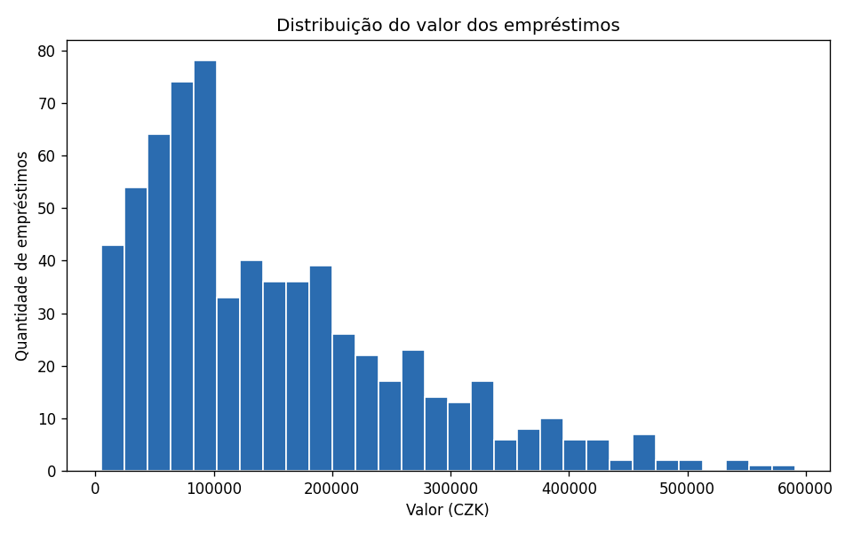
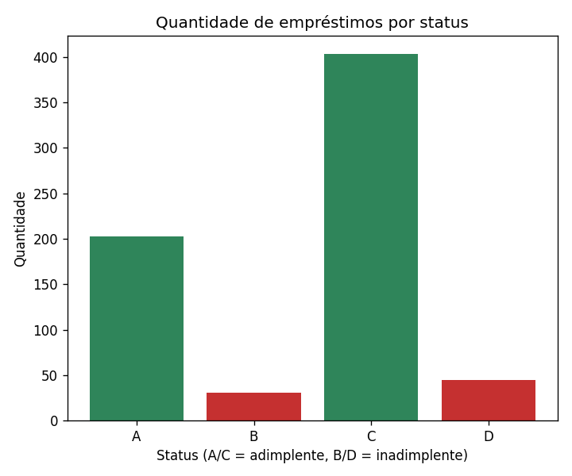
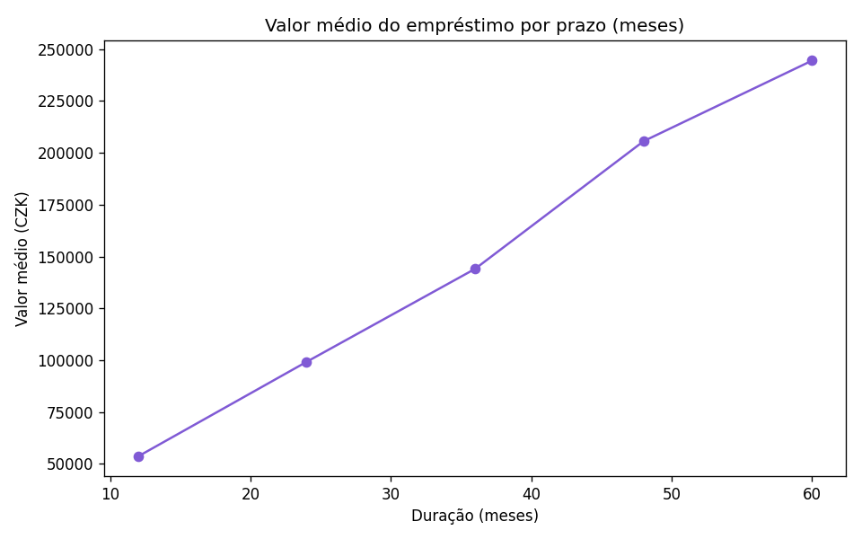
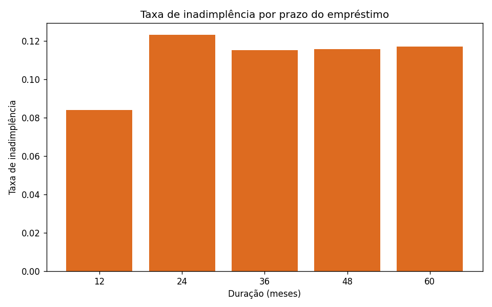

# Relatório de EDA — Observatório de Negócio (Beaumont Bank)

Gerado automaticamente por `src/eda.py` a partir de `data/beaumont_bank.db`.

## Visão geral da carteira

| Métrica | Valor |
|---|---|
| Total de empréstimos | 682 |
| Total emprestado | 103,261,740.00 CZK |
| Ticket médio | 151,410.18 CZK |
| Duração média | 36.5 meses |
| Taxa de inadimplência (status B/D) | 11.1% |
| Total de contas | 4500 |

## Distribuição do valor dos empréstimos

A maior parte dos empréstimos se concentra nas faixas de menor valor, com uma
cauda longa de contratos de valores mais altos.

## Empréstimos por status

- **A**: contrato encerrado, pago sem problemas
- **B**: contrato encerrado, mas com atraso no passado (inadimplência)
- **C**: contrato ativo, em dia
- **D**: contrato ativo, com problema (inadimplência)

## Valor médio por prazo do empréstimo

## Taxa de inadimplência por prazo

Prazos mais longos tendem a concentrar contratos de maior valor — vale
observar se também concentram maior risco, o que reforça a necessidade do
modelo de classificação de risco (`src/classificacao_risco.py`).

## Limitação dos dados

Esta análise usa apenas as tabelas `account` e `loan` do dataset Berka
(as únicas recuperadas). O dataset completo tem também `district`, `client`,
`disp`, `trans` e `card`, que permitiriam quebras por região e por perfil de
cliente — não incluídas aqui por falta desses arquivos.
